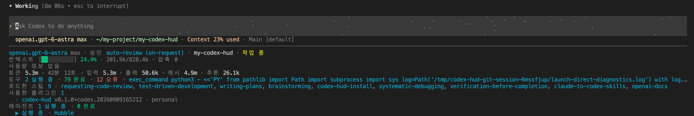
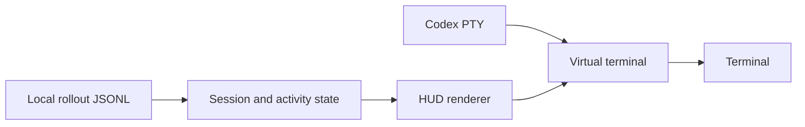

# Codex HUD

[](LICENSE) [](#testing) [](package.json) [](#english) [](#한국어)

A live terminal HUD for Codex CLI, powered by local session logs. / 로컬 세션 기록으로 Codex CLI의 작업 상태를 실시간 표시하는 터미널 HUD입니다.

---

# English

## Overview

Monitor Codex CLI's model, context, usage and activity from local rollout JSONL files without making account API requests. Run Codex above a fixed HUD, or watch an existing session from another terminal.



The screenshot shows an example session; explore architecture, operations and verification records in the [documentation index](docs/README.md).

## Features

- **Single-terminal display** — Keep the HUD below Codex, use native scrollback and text selection, and choose captured mouse scrolling or tmux when needed.
- **Session insight** — Show model/reasoning and approval settings, context usage, recorded usage limits, token totals, elapsed time and optional Git status.
- **Activity tracking** — Track tools, observed skill/plugin reads, running agents and plans. Hide completed agents and keep skill names on one clipped line.
- **Scoped installation and updates** — Install for a user or project, preserve existing paths and shell settings during updates, and reject unintended downgrades.
- **Diagnostics and controls** — Check real PTY startup and macOS helper permissions; select three presets, English/Korean output and live keyboard controls.

## Prerequisites

- Node.js **20+** and npm.
- Codex CLI on `PATH` for `start` and runtime installation/update; use a CLI with `plugin marketplace` support for GitHub plugin installation.
- Python **3.9+** for the bundled installer, skill registration, installer tests and packaging.
- Git for GitHub/source workflows, development and optional repository status.
- Linux, macOS or WSL with interactive stdin/stdout for inline `start`. Use WSL for inline execution on Windows.
- Bash or Zsh for shell autostart; tmux only for `start --tmux`.
- Python, a C/C++ compiler, make and Node headers if `node-pty` needs a native build.

Runtime dependencies are pinned to `node-pty` **1.1.0**, `@xterm/headless` **6.0.0** and `@xterm/addon-unicode11` **0.9.0**. npm needs network access or a populated cache to obtain dependencies.

## Installation

### GitHub plugin (recommended)

Use the GitHub plugin so Codex manages its source and cache:

```bash
# Register the repository's marketplace.
codex plugin marketplace add whchoi98/my-codex-hud --ref main
# Install the HUD installation plugin.
codex plugin add codex-hud@codex-hud
```

Open a new Codex conversation and request the runtime installation:

```text
$codex-hud-install Install the HUD for this user and enable shell autostart.
```

For a project-only installation:

```text
$codex-hud-install Install the HUD only for the current project and enable scoped autostart.
```

| Stage | Evidence |
| --- | --- |
| Plugin or skill registration | Installed/enabled plugin in `codex plugin list --json`, or the standalone skill registration result |
| HUD runtime installation | The installed command's `--version` and `doctor --json` results |
| Autostart configuration | `hud.autostart.configured`, followed by sourcing `shell.sh` and checking `type -a codex` in that terminal |

Plugin registration does not install the HUD executable. The default user prefix is `~/.local/share/codex-hud`, or `$XDG_DATA_HOME/codex-hud`. A project installation defaults to `<project>/.codex-hud`, leaves user startup files and `PATH` unchanged, and applies autostart only within the activated project's directory boundary.

### Update an existing installation

Refresh the plugin and its bundled package:

```bash
# Fetch the marketplace's tracked source.
codex plugin marketplace upgrade codex-hud
# Install the refreshed plugin.
codex plugin add codex-hud@codex-hud
```

Then open a new conversation and update the installed runtime separately:

```text
$codex-hud-install Update the existing HUD while preserving its scope, prefix, language and autostart settings.
```

The 0.7.0 installer provides read-only `--status` and settings-preserving `--update` operations. It compares installed/bundled versions before npm runs, rejects unknown versions and unintended downgrades, and does not reinstall an equal version. Read the [installer guide](plugins/codex-hud/README.md) for custom prefixes, explicit downgrade requests and repair.

### Standalone skill or source installation

Use a standalone skill when plugin commands are unavailable or you prefer managing its directory:

```text
Use $skill-installer to install https://github.com/whchoi98/my-codex-hud/tree/main/plugins/codex-hud/skills/codex-hud-install into ~/.agents/skills
```

Keep the complete skill folder, including `scripts/`, `assets/` and `agents/`. Choose one registration method to avoid duplicate skill entries.

For direct installation from source:

```bash
# Clone the source.
git clone --depth 1 https://github.com/whchoi98/my-codex-hud.git
cd my-codex-hud
# Install the locked dependencies and CLI.
npm ci
npm install -g .
# Check the installed command.
codex-hud doctor
```

Source installation does not configure shell autostart. To avoid global installation, run `node bin/codex-hud.js` from the checkout after `npm ci`. The project does not assume the package is published to the npm registry.

## Usage

Choose the command for your workflow:

```bash
# Show the installed version.
codex-hud --version
# Expected output: 0.7.0

# Preview a Korean HUD without a saved session.
codex-hud demo --language ko --no-color
# Run Codex and the HUD in one terminal.
codex-hud start --language ko
# Use the optional tmux backend.
codex-hud start --tmux --language ko
# Monitor the current project from a separate terminal.
codex-hud watch --cwd . --language ko
# Print a compact snapshot.
codex-hud status --preset minimal --ascii --no-color
# Print a native Codex status-line configuration snippet.
codex-hud setup
```

| Control | Action |
| --- | --- |
| `Alt+L` | Switch English/Korean for the current run |
| `Alt+M` | Freeze/resume painting for text selection |
| `Alt+PageUp` / `Alt+PageDown` | Page overflowing HUD rows |
| `Shift+PageUp` / `Shift+PageDown` | Browse the emulator's normal-screen history in inline mode |
| `Ctrl+C` | Forward to Codex in inline mode; stop standalone `watch` |

Use the terminal wheel and drag selection by default. Add `--mouse` for captured HUD/emulator scrolling; release capture with `Alt+M` before dragging. Leaving selection preserves the emulator's scroll position. Use `--no-mouse` to override a saved capture preference.

Frozen selection delays native-history transfers in a bounded 5,000-row queue. Resume painting before Codex exits if pending output must remain in terminal history.

Choose `full`, `essential` or `minimal` with `--preset`. The full activity order is tools, loaded skills, plugins, running agents and plan. Skills occupy one clipped line; agent sections disappear when no agents are running. Skill/plugin lists describe successful document reads in this session, not an inventory of all installed components.

Automatic session selection matches the exact project directory and excludes child/internal sessions. `watch` pins its first match; use `--follow` to follow newer activity or `--session` to select a path/UUID. Put Codex arguments after `start --`; keep HUD options before `--`. Pin the HUD explicitly when resumed sessions are ambiguous.

Redirected `watch`, `--once` and `--json` produce a single snapshot. `setup` only prints TOML. Run `codex-hud --help` for all options, and read [terminal controls](docs/reference/terminal.md), [session selection](docs/reference/session-data.md) and [troubleshooting](docs/runbooks/troubleshooting.md) for details.

## Configuration

| Variable | Description | Default |
| --- | --- | --- |
| `CODEX_HOME` | Codex data directory containing sessions and default HUD preferences | `~/.codex` |
| `NO_COLOR` | Disable color when set | Unset |
| `TERM` | Disable color when its value is `dumb` | Inherited from the terminal |
| `XDG_DATA_HOME` | Base directory for user-scoped HUD installation | `~/.local/share` |
| `SHELL` | Initial Bash/Zsh selection for fresh shell setup | Inherited; `none` when unsupported or unset |
| `ZDOTDIR` | Directory containing `.zshrc` for Zsh setup | `~` |

Store preferences in `$CODEX_HOME/codex-hud.json`. `--codex-home` selects another data directory; `--config` selects a different JSON file. Apply defaults, then the selected file, then explicit CLI options. For example, [examples/config.json](examples/config.json) selects Korean:

```json
{
  "preset": "full",
  "language": "ko",
  "interval": 1000,
  "width": null,
  "pathLevels": 1,
  "color": true,
  "ascii": false,
  "git": true,
  "mouse": false
}
```

| Preference | Allowed values | Default |
| --- | --- | --- |
| `preset` | `full`, `essential`, `minimal` | `full` |
| `language` | `en`, `ko` | `en` |
| `interval` | Integer, 200–60000 milliseconds | `1000` |
| `width` | `null` or integer, 1–1000 columns | `null` |
| `pathLevels` | `1`, `2`, `3` | `1` |
| `color` | `true`, `false` | `true` |
| `ascii` | `true`, `false` | `false` |
| `git` | `true`, `false` | `true` |
| `mouse` | `true`, `false` | `false` |

A missing default file uses defaults. Missing explicit files, invalid JSON, unknown preferences or invalid values fail with an error; files are limited to 64 KiB. Help and version do not load preferences. Color also requires terminal output. Autostart passes its saved language explicitly; fresh installer setup defaults to `ko`.

### Native Codex status line

`codex-hud setup` prints this optional built-in status-line configuration:

```toml
[tui]
status_line = ["model-with-reasoning", "current-dir", "git-branch", "context-remaining", "five-hour-limit", "weekly-limit", "used-tokens"]
```

Merge it into `$CODEX_HOME/config.toml` (default `~/.codex/config.toml`) and restart Codex. Update an existing `[tui]` table rather than adding a second one. `tui.status_line` selects built-in items; it does not launch the HUD. Read the [Codex configuration reference](https://developers.openai.com/codex/config-reference/) for the native setting.

## Project Structure

```text
my-codex-hud/
├── .agents/plugins/marketplace.json  # GitHub marketplace catalogue
├── bin/codex-hud.js                  # CLI entrypoint
├── src/
│   ├── cli.js                       # Commands and options
│   ├── sessions.js                  # Session discovery
│   ├── transcript.js                # Incremental JSONL reading
│   ├── state.js                     # Normalized session state
│   ├── activity.js                  # Tools, agents and plans
│   ├── skills.js                    # Observed skill/plugin reads
│   ├── watch.js                     # Standalone polling
│   ├── hud-source.js                # Inline HUD data polling
│   ├── config.js                    # Preferences and native status-line snippet
│   ├── render.js                    # HUD rendering
│   ├── terminal.js                  # Terminal cell widths and text
│   ├── inline.js                    # Inline process and terminal lifecycle
│   ├── screen.js                    # Virtual terminal and HUD compositing
│   ├── pty.js                       # PTY startup and probing
│   ├── scrollback.js                # Native terminal history
│   ├── installation.js              # Installation and version diagnostics
│   └── repair-node-pty.js            # macOS helper inspection/repair
├── plugins/codex-hud/                # Plugin metadata and bundled install skill
├── scripts/package-plugin.py        # npm bundle and ZIP generation
├── tests/                           # Node and Python regression tests
├── docs/                            # Architecture, references and runbooks
└── my-codex-hud.png                  # README screenshot
```



Read the [architecture](docs/architecture.md), [implementation index](docs/reference/INDEX.md) and [onboarding guide](docs/onboarding.md). Only inline `start` and `doctor` load the native PTY dependency; `watch`, `status`, `demo` and `setup` remain separate workflows.

## Testing

Run tests from the source checkout:

```bash
# Run the Node suite and JavaScript syntax checks.
npm test
npm run check
# Run installer and registration tests.
npm run test:installer
# Run a focused diagnostic test file.
node --test tests/doctor.test.js
# Print coverage for the rendering tests.
node --experimental-test-coverage --test tests/render.test.js
# Rebuild plugin/skill distributions after the final edit.
npm run package:plugin
```

No CI workflow or hosted coverage report is configured. The coverage command reports only the selected rendering tests; see the [verification record](docs/verification-0.7.0.md) for the full-suite coverage trial and its PTY resize failure.

Reuse valid runtime results for documentation-only changes when code, dependencies and test settings are unchanged. Verify document links, screenshots and packaged content instead of repeating full suites solely for a commit. Follow [CONTRIBUTING.md](CONTRIBUTING.md) and the [release runbook](docs/runbooks/release.md) for required checks.

Read the [0.7.0 verification record](docs/verification-0.7.0.md) for Linux automation, real installation/update trials and the user's subsequent Mac confirmation. The automated tests do not operate a VS Code GUI.

## API Documentation

Consume normalized CLI JSON output:

```bash
# Read normalized session metadata.
codex-hud status --json
# Read installation, bundle, terminal and PTY diagnostics.
codex-hud doctor --json
```

| Output | Contract |
| --- | --- |
| `status --json` | Session, context, token, activity and Git metadata; `null` when no session is selected |
| `doctor --json` | Running HUD version/path, installation settings, plugin/bundle comparison, terminal context and PTY results |
| `install.py --status` | Selected prefix, installed/bundled versions and saved configuration without installation |

For doctor, `hud.autostart.configured` describes saved setup; `hud.autostart.active` is `null` when parent-shell activation cannot be determined. Doctor can exit successfully while reporting an unavailable dependency; inspect its fields. Successful native startup requires `inline.available: true` and `inline.probe.status: ok`. Use `doctor --bundle` with the installation skill's `assets/package.json` to select a comparison target, especially with multiple enabled plugins.

Session usage limits are recorded snapshots, not live account queries. Context uses the last reported token usage and context window; cumulative tokens are separate. Missing values remain unavailable; monetary cost is not calculated. Full prompts and tool-output bodies are not retained in normalized state.

Read [session data](docs/reference/session-data.md) and [installation diagnostics](docs/reference/installation.md) for fields, bounds, version comparisons and failure behavior.

## Contributing

1. **Fork** the [repository](https://github.com/whchoi98/my-codex-hud/fork) and clone your fork.
2. **Branch** from the current upstream code with `git switch -c docs/update-installation`.
3. **Commit** intended changes after the relevant checks. Use Conventional Commits, for example `git commit -m "docs: update installation guide"`.
4. **Push** to your fork with `git push -u origin docs/update-installation`.
5. **Open a PR** against upstream `main` through [Pull requests](https://github.com/whchoi98/my-codex-hud/pulls), describing behavior and actual validation.

Follow [AGENTS.md](AGENTS.md) and [CONTRIBUTING.md](CONTRIBUTING.md). Keep both README language sections synchronized, preserve historical verification results, update [CHANGELOG.md](CHANGELOG.md), and regenerate the bundled packages after final source/document edits.

## License

Use this project under the [MIT License](LICENSE). The UI and feature design were inspired by [Jarrod Watts's claude-hud](https://github.com/jarrodwatts/claude-hud); attribution is preserved in [NOTICE](NOTICE).

This is an independent project, not an official OpenAI or Anthropic product. Read [CHANGELOG.md](CHANGELOG.md) for release history.

## Contact

- Maintainer: [Woo Hyung Choi / whchoi98](https://github.com/whchoi98).
- Questions and bug reports: [GitHub Issues](https://github.com/whchoi98/my-codex-hud/issues).
- Email: not publicly listed; use GitHub Issues.

---

# 한국어

## 개요

계정 API 요청 없이 로컬 rollout JSONL 파일에서 Codex CLI의 모델·컨텍스트·사용량·활동 정보를 확인합니다. Codex 아래에 HUD를 고정하거나 별도 터미널에서 기존 세션을 모니터링합니다.


스크린샷은 한 세션의 예시이며, 아키텍처·운영·검증 자료는 [문서 목차](docs/README.md)에서 확인합니다.

## 주요 기능

- **한 터미널 화면 구성** — Codex 아래에 HUD를 표시하고 기본 스크롤백·드래그 선택을 사용합니다. 필요하면 마우스 캡처나 tmux 방식을 선택합니다.
- **세션 상태 확인** — 모델·추론·승인 설정, 컨텍스트 사용률, 기록된 사용 한도, 누적 토큰, 경과 시간과 선택적 Git 상태를 표시합니다.
- **활동 추적** — 도구, 관측한 스킬·플러그인 읽기, 실행 중인 에이전트와 계획을 추적합니다. 완료된 에이전트는 숨기고 스킬 이름은 너비에 맞춘 한 줄로 표시합니다.
- **범위별 설치와 업데이트** — 사용자 또는 프로젝트 범위로 설치하고, 기존 경로·셸 설정을 보존하며 업데이트합니다. 의도하지 않은 다운그레이드는 차단합니다.
- **진단과 실행 중 제어** — 실제 PTY 시작과 macOS helper 권한을 확인합니다. 세 가지 표시 모드, 한글·영문 출력과 실행 중 단축키를 제공합니다.

## 사전 요구 사항

- Node.js **20 이상**과 npm이 필요합니다.
- `start`와 실제 설치·업데이트에는 PATH의 Codex CLI가 필요합니다. GitHub 플러그인 설치에는 `plugin marketplace` 명령을 지원하는 CLI를 사용합니다.
- 동봉 설치 도구, 스킬 등록, 설치 테스트와 패키징에는 Python **3.9 이상**이 필요합니다.
- GitHub·소스 작업, 개발과 선택적 저장소 상태 확인에는 Git이 필요합니다.
- Inline `start`는 Linux·macOS·WSL과 대화형 표준 입력·출력이 필요합니다. Windows의 inline 실행은 WSL을 사용합니다.
- 셸 자동 실행에는 Bash 또는 Zsh가 필요하며, tmux는 `start --tmux`에서만 필요합니다.
- `node-pty`를 직접 빌드해야 하면 Python, C/C++ 컴파일러, make와 Node 헤더가 필요합니다.

런타임 의존성은 `node-pty` **1.1.0**, `@xterm/headless` **6.0.0**, `@xterm/addon-unicode11` **0.9.0**으로 고정되어 있습니다. npm 의존성을 가져오려면 네트워크 또는 채워진 캐시가 필요합니다.

## 설치 방법

### GitHub 플러그인 (권장)

Codex가 소스와 캐시를 관리하는 GitHub 플러그인 방식을 권장합니다.

```bash
# 저장소의 마켓플레이스를 등록합니다.
codex plugin marketplace add whchoi98/my-codex-hud --ref main
# HUD 설치 플러그인을 설치합니다.
codex plugin add codex-hud@codex-hud
```

새 Codex 대화에서 HUD 실행 파일 설치를 요청합니다.

```text
$codex-hud-install 사용자 전체에 HUD를 설치하고 셸 자동 실행을 설정해줘.
```

현재 프로젝트에만 설치할 때는 다음과 같이 요청합니다.

```text
$codex-hud-install 현재 프로젝트에만 HUD를 설치하고 해당 범위의 자동 실행을 설정해줘.
```

| 단계 | 확인 근거 |
| --- | --- |
| 플러그인 또는 스킬 등록 | `codex plugin list --json`의 설치·활성 상태 또는 단독 스킬 등록 결과 |
| HUD 실행 파일 설치 | 설치된 명령의 `--version`과 `doctor --json` 결과 |
| 자동 실행 설정 | `hud.autostart.configured` 확인 후 해당 터미널에서 `shell.sh`를 읽고 `type -a codex`로 확인 |

플러그인 등록만으로 HUD 실행 파일이 설치되지는 않습니다. 사용자 기본 prefix는 `~/.local/share/codex-hud` 또는 `$XDG_DATA_HOME/codex-hud`입니다. 프로젝트 설치는 `<project>/.codex-hud`를 기본값으로 사용하고 사용자 시작 파일과 PATH를 변경하지 않으며, 활성화한 프로젝트의 디렉터리 경계 안에서만 자동 실행을 적용합니다.

### 기존 설치 업데이트

플러그인과 동봉 패키지를 먼저 갱신합니다.

```bash
# 마켓플레이스가 추적하는 소스를 갱신합니다.
codex plugin marketplace upgrade codex-hud
# 갱신한 플러그인을 설치합니다.
codex plugin add codex-hud@codex-hud
```

새 대화를 열고 설치된 HUD 실행 파일을 별도로 업데이트합니다.

```text
$codex-hud-install 기존 HUD의 범위·prefix·언어·자동 실행 설정을 유지하면서 업데이트해줘.
```

0.7.0 설치 도구는 읽기 전용 `--status`와 설정을 보존하는 `--update`를 제공합니다. npm 실행 전에 설치·동봉 버전을 비교하고, 확인할 수 없는 버전과 의도하지 않은 다운그레이드를 거부합니다. 같은 버전은 재설치하지 않습니다. 사용자 지정 prefix, 명시적인 다운그레이드 요청과 복구 방법은 [설치 안내](plugins/codex-hud/README.md)를 참고합니다.

### 단독 스킬 또는 소스 설치

플러그인 명령을 사용할 수 없거나 스킬 폴더를 직접 관리하려면 단독 스킬을 선택합니다.

```text
Use $skill-installer to install https://github.com/whchoi98/my-codex-hud/tree/main/plugins/codex-hud/skills/codex-hud-install into ~/.agents/skills
```

`scripts/`, `assets/`, `agents/`를 포함한 전체 스킬 폴더를 유지합니다. 중복 스킬 항목이 생기지 않도록 등록 방식은 하나를 선택합니다.

소스에서 직접 설치하려면 다음을 실행합니다.

```bash
# 소스를 복제합니다.
git clone --depth 1 https://github.com/whchoi98/my-codex-hud.git
cd my-codex-hud
# 잠금 파일의 의존성과 CLI를 설치합니다.
npm ci
npm install -g .
# 설치된 명령을 확인합니다.
codex-hud doctor
```

소스 설치는 셸 자동 실행을 설정하지 않습니다. 전역 설치 없이 사용하려면 `npm ci` 후 체크아웃에서 `node bin/codex-hud.js`를 실행합니다. 이 프로젝트는 npm 레지스트리에 패키지가 배포되어 있다는 전제를 두지 않습니다.

## 사용법

작업 방식에 맞는 명령을 선택합니다.

```bash
# 설치된 버전을 확인합니다.
codex-hud --version
# 예상 출력: 0.7.0

# 저장된 세션 없이 한글 HUD를 미리 봅니다.
codex-hud demo --language ko --no-color
# 한 터미널에서 Codex와 HUD를 실행합니다.
codex-hud start --language ko
# 선택적으로 tmux 방식을 사용합니다.
codex-hud start --tmux --language ko
# 별도 터미널에서 현재 프로젝트를 모니터링합니다.
codex-hud watch --cwd . --language ko
# 간단한 스냅샷을 출력합니다.
codex-hud status --preset minimal --ascii --no-color
# Codex 내장 상태줄 설정 조각을 출력합니다.
codex-hud setup
```

| 단축키 | 동작 |
| --- | --- |
| `Alt+L` | 현재 실행의 한글·영문을 전환합니다. |
| `Alt+M` | 텍스트 선택을 위해 화면 갱신을 고정·재개합니다. |
| `Alt+PageUp` / `Alt+PageDown` | 넘치는 HUD 목록을 페이지 단위로 이동합니다. |
| `Shift+PageUp` / `Shift+PageDown` | Inline에서 가상 터미널의 일반 화면 기록을 탐색합니다. |
| `Ctrl+C` | Inline에서는 Codex에 전달하고, 별도 `watch`에서는 종료합니다. |

기본적으로 터미널의 휠과 드래그 선택을 사용합니다. HUD·가상 화면의 캡처 스크롤은 `--mouse`로 켜며, 드래그하기 전 `Alt+M`으로 캡처를 해제합니다. 선택을 끝내도 가상 터미널의 탐색 위치는 유지됩니다. 저장된 캡처 설정을 해제하려면 `--no-mouse`를 사용합니다.

선택 모드로 화면을 고정하면 실제 터미널 기록 전달도 최대 5,000행의 대기열에서 기다립니다. 아직 전달하지 않은 출력을 기록에 남기려면 Codex가 종료되기 전에 화면 갱신을 재개합니다.

`--preset`으로 `full`, `essential`, `minimal`을 선택합니다. Full 활동 순서는 도구, 로드한 스킬, 플러그인, 실행 중인 에이전트, 계획입니다. 스킬은 너비에 맞춘 한 줄로 표시하고, 실행 중인 에이전트가 없으면 에이전트 영역을 생략합니다. 스킬·플러그인 목록은 이 세션에서 성공한 문서 읽기 이력을 나타내며, 설치된 전체 구성요소 목록은 아닙니다.

자동 세션 선택은 프로젝트 디렉터리의 정확한 일치를 요구하며 자식·내부 세션은 제외합니다. `watch`는 처음 선택한 세션을 고정합니다. 새 활동을 따라가려면 `--follow`, 경로·UUID로 지정하려면 `--session`을 사용합니다. Codex 인자는 `start --` 뒤에, HUD 옵션은 `--` 앞에 둡니다. 재개한 세션을 구분하기 어려우면 HUD 대상을 명시합니다.

리다이렉트한 `watch`, `--once`, `--json`은 한 번만 출력합니다. `setup`은 TOML을 출력만 합니다. 전체 옵션은 `codex-hud --help`로 확인하고, 자세한 내용은 [터미널 제어](docs/reference/terminal.md), [세션 선택](docs/reference/session-data.md), [문제 해결](docs/runbooks/troubleshooting.md)을 참고합니다.

## 환경 설정

| 변수명 | 설명 | 기본값 |
| --- | --- | --- |
| `CODEX_HOME` | 세션과 기본 HUD 설정을 보관하는 Codex 데이터 디렉터리 | `~/.codex` |
| `NO_COLOR` | 설정되어 있으면 색상을 사용하지 않습니다. | 미설정 |
| `TERM` | 값이 `dumb`이면 색상을 사용하지 않습니다. | 터미널에서 상속 |
| `XDG_DATA_HOME` | 사용자 범위 HUD 설치의 기준 디렉터리 | `~/.local/share` |
| `SHELL` | 새 셸 설정의 초기 Bash·Zsh 선택 | 상속하며, 미지원·미설정이면 `none` |
| `ZDOTDIR` | Zsh 설정에서 `.zshrc`를 찾는 디렉터리 | `~` |

설정은 `$CODEX_HOME/codex-hud.json`에 저장합니다. `--codex-home`은 다른 데이터 디렉터리를, `--config`는 별도 JSON 파일을 선택합니다. 기본값, 선택한 파일, 명시한 CLI 옵션 순서로 적용합니다. 다음 [examples/config.json](examples/config.json)은 한글 표시를 선택합니다.

```json
{
  "preset": "full",
  "language": "ko",
  "interval": 1000,
  "width": null,
  "pathLevels": 1,
  "color": true,
  "ascii": false,
  "git": true,
  "mouse": false
}
```

| 설정 | 허용 값 | 기본값 |
| --- | --- | --- |
| `preset` | `full`, `essential`, `minimal` | `full` |
| `language` | `en`, `ko` | `en` |
| `interval` | 정수, 200–60000밀리초 | `1000` |
| `width` | `null` 또는 정수, 1–1000열 | `null` |
| `pathLevels` | `1`, `2`, `3` | `1` |
| `color` | `true`, `false` | `true` |
| `ascii` | `true`, `false` | `false` |
| `git` | `true`, `false` | `true` |
| `mouse` | `true`, `false` | `false` |

기본 파일이 없으면 기본값을 사용합니다. 명시한 파일이 없거나 JSON·설정 이름·값이 잘못되면 오류로 종료하며, 파일 크기는 64 KiB로 제한합니다. 도움말과 버전은 설정 파일을 읽지 않습니다. 색상은 터미널 출력일 때만 사용합니다. 자동 실행은 저장된 언어를 명시적으로 전달하며, 새 설치 설정의 기본 언어는 `ko`입니다.

### Codex 내장 상태줄

`codex-hud setup`은 선택적으로 사용할 내장 상태줄 설정을 출력합니다.

```toml
[tui]
status_line = ["model-with-reasoning", "current-dir", "git-branch", "context-remaining", "five-hour-limit", "weekly-limit", "used-tokens"]
```

`$CODEX_HOME/config.toml`(기본 `~/.codex/config.toml`)에 병합하고 Codex를 재시작합니다. 기존 `[tui]` 테이블이 있으면 새 테이블을 중복 추가하지 않고 그 안에서 수정합니다. `tui.status_line`은 내장 항목을 선택하는 설정이며 HUD를 실행하지 않습니다. 내장 설정은 [Codex 설정 참조](https://developers.openai.com/codex/config-reference/)를 참고합니다.

## 프로젝트 구조

```text
my-codex-hud/
├── .agents/plugins/marketplace.json  # GitHub 마켓플레이스 목록
├── bin/codex-hud.js                  # CLI 진입점
├── src/
│   ├── cli.js                       # 명령과 옵션
│   ├── sessions.js                  # 세션 탐색
│   ├── transcript.js                # JSONL 증분 읽기
│   ├── state.js                     # 정규화한 세션 상태
│   ├── activity.js                  # 도구·에이전트·계획
│   ├── skills.js                    # 관측한 스킬·플러그인 읽기
│   ├── watch.js                     # 별도 터미널 갱신
│   ├── hud-source.js                # Inline HUD 데이터 갱신
│   ├── config.js                    # 설정과 내장 상태줄 설정 조각
│   ├── render.js                    # HUD 표시
│   ├── terminal.js                  # 터미널 셀 너비와 텍스트
│   ├── inline.js                    # Inline 프로세스·터미널 수명 관리
│   ├── screen.js                    # 가상 터미널·HUD 화면 합성
│   ├── pty.js                       # PTY 시작과 프로브
│   ├── scrollback.js                # 실제 터미널 기록
│   ├── installation.js              # 설치·버전 진단
│   └── repair-node-pty.js            # macOS helper 검사·복구
├── plugins/codex-hud/                # 플러그인 메타데이터와 동봉 설치 스킬
├── scripts/package-plugin.py        # npm 번들과 ZIP 생성
├── tests/                           # Node·Python 회귀 테스트
├── docs/                            # 아키텍처·참조·런북
└── my-codex-hud.png                  # README 스크린샷
```


[아키텍처](docs/architecture.md), [구현 목차](docs/reference/INDEX.md), [온보딩](docs/onboarding.md)을 참고합니다. 네이티브 PTY 의존성은 inline `start`와 `doctor`만 불러오며, `watch`, `status`, `demo`, `setup`은 별도 흐름으로 동작합니다.

## 테스트

소스 체크아웃에서 테스트를 실행합니다.

```bash
# Node 테스트와 JavaScript 문법 검사를 실행합니다.
npm test
npm run check
# 설치·등록 테스트를 실행합니다.
npm run test:installer
# 진단 테스트 파일 하나를 실행합니다.
node --test tests/doctor.test.js
# 렌더링 테스트의 커버리지를 출력합니다.
node --experimental-test-coverage --test tests/render.test.js
# 마지막 편집 후 플러그인·스킬 배포 파일을 다시 만듭니다.
npm run package:plugin
```

CI 워크플로와 호스팅된 커버리지 보고서는 구성되어 있지 않습니다. 커버리지 명령은 선택한 렌더링 테스트만 측정합니다. 전체 커버리지 실행과 당시 PTY 리사이즈 실패는 [검증 기록](docs/verification-0.7.0.md)을 참고합니다.

문서만 바꾼 경우 코드·의존성·테스트 설정이 같으면 유효한 기존 실행 검증 결과를 재사용합니다. 커밋만을 이유로 전체 테스트를 반복하기보다 문서 링크·스크린샷·배포 내용을 확인합니다. 필수 검증은 [CONTRIBUTING.md](CONTRIBUTING.md)와 [릴리스 런북](docs/runbooks/release.md)을 따릅니다.

Linux 자동 검증, 실제 설치·업데이트 시험, 이후 Mac 사용자 확인은 [0.7.0 검증 기록](docs/verification-0.7.0.md)을 참고합니다. 자동 테스트는 VS Code GUI를 조작하지 않습니다.

## API 문서

CLI의 정규화된 JSON 출력을 사용할 수 있습니다.

```bash
# 정규화된 세션 메타데이터를 읽습니다.
codex-hud status --json
# 설치·동봉 버전·터미널·PTY 진단을 읽습니다.
codex-hud doctor --json
```

| 출력 | 계약 |
| --- | --- |
| `status --json` | 세션·컨텍스트·토큰·활동·Git 메타데이터이며, 선택한 세션이 없으면 `null`입니다. |
| `doctor --json` | 실행 중인 HUD 버전·경로, 설치 설정, 플러그인·동봉 버전 비교, 터미널 정보와 PTY 결과입니다. |
| `install.py --status` | 설치 없이 선택한 prefix의 설치·동봉 버전과 저장된 설정을 확인합니다. |

Doctor의 `hud.autostart.configured`는 저장된 설정을 나타내며, 부모 셸의 활성화 여부를 확인할 수 없으면 `hud.autostart.active`는 `null`입니다. Doctor는 의존성 실패를 보고해도 정상 종료할 수 있으므로 각 필드를 확인합니다. 네이티브 시작 성공에는 `inline.available: true`와 `inline.probe.status: ok`가 필요합니다. 특히 플러그인이 여러 개 활성화되어 있으면 `doctor --bundle`에 설치 스킬의 `assets/package.json`을 지정해 비교 대상을 선택합니다.

세션 사용 한도는 실시간 계정 조회가 아닌 기록된 스냅샷입니다. 컨텍스트는 마지막으로 보고된 토큰과 컨텍스트 크기를 사용하고 누적 토큰과 구분합니다. 값이 없으면 미확인으로 유지하고 금액 기준 비용은 계산하지 않습니다. 정규화 상태에는 전체 프롬프트와 도구 출력 본문을 보관하지 않습니다.

필드·보관 한도·버전 비교·실패 동작은 [세션 데이터](docs/reference/session-data.md)와 [설치 진단](docs/reference/installation.md)을 참고합니다.

## 기여 방법

1. **Fork**: [저장소](https://github.com/whchoi98/my-codex-hud/fork)를 포크하고 자신의 포크를 복제합니다.
2. **Branch**: 최신 원본 코드를 기준으로 `git switch -c docs/update-installation`을 실행합니다.
3. **Commit**: 필요한 검증 후 의도한 변경을 커밋합니다. Conventional Commits 형식의 `git commit -m "docs: update installation guide"`를 예시로 사용합니다.
4. **Push**: `git push -u origin docs/update-installation`으로 자신의 포크에 푸시합니다.
5. **PR**: [Pull requests](https://github.com/whchoi98/my-codex-hud/pulls)에서 원본 `main`을 대상으로 PR을 열고 동작과 실제 검증 결과를 설명합니다.

[AGENTS.md](AGENTS.md)와 [CONTRIBUTING.md](CONTRIBUTING.md)를 따릅니다. README의 두 언어를 함께 동기화하고 과거 검증 기록을 보존하며, [CHANGELOG.md](CHANGELOG.md)를 갱신합니다. 마지막 소스·문서 편집 후 동봉 패키지를 다시 생성합니다.

## 라이선스

이 프로젝트는 [MIT 라이선스](LICENSE)를 따릅니다. UI와 기능 설계는 [Jarrod Watts의 claude-hud](https://github.com/jarrodwatts/claude-hud)에서 영감을 받았으며, 출처 고지는 [NOTICE](NOTICE)에 보존합니다.

OpenAI 또는 Anthropic의 공식 제품이 아닌 독립 프로젝트입니다. 버전별 변경 이력은 [CHANGELOG.md](CHANGELOG.md)를 참고합니다.

## 연락처

- 유지관리자: [Woo Hyung Choi / whchoi98](https://github.com/whchoi98)입니다.
- 질문·버그 보고: [GitHub Issues](https://github.com/whchoi98/my-codex-hud/issues)를 사용합니다.
- 이메일: 공개된 주소가 없어 GitHub Issues로 문의합니다.
