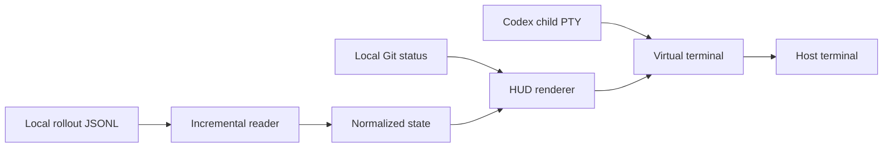

# Codex HUD Architecture

<a href="#english">English</a> · <a href="#korean">한국어</a>

## English

### Overview

Codex HUD reads local rollout JSONL files and renders normalized session metadata.
The default launcher runs Codex in a smaller PTY and composites its terminal
screen above a fixed HUD. A separate watch mode and optional tmux launcher use
the same session/state/rendering components.

| Area | Code |
|---|---|
| CLI and preferences | [cli.js](../src/cli.js), [config.js](../src/config.js) |
| Session selection/read | [sessions.js](../src/sessions.js), [transcript.js](../src/transcript.js) |
| State and activity | [state.js](../src/state.js), [activity.js](../src/activity.js) |
| Presentation | [render.js](../src/render.js), [viewport.js](../src/viewport.js) |
| Inline PTY | [inline.js](../src/inline.js), [screen.js](../src/screen.js), [pty.js](../src/pty.js) |
| Standalone launch | [watch.js](../src/watch.js), [launch.js](../src/launch.js) |
| Distribution | [package-plugin.py](../scripts/package-plugin.py) |

### Constraints

Session selection uses the requested project or explicit session. The reader
handles appended/truncated/replaced files without retaining full prompts or tool
outputs in normalized state. Rendering sanitizes terminal controls and clips to
terminal cell widths. Only running agents are displayed.

The inline launcher owns terminal mode restoration and child cleanup. Native
text dragging is enabled by default; host mouse capture, including child requests,
requires `--mouse`. Runtime language switching uses cached state; selection mode
freezes physical painting and releases capture while Codex continues. Resuming
restores the configured mouse policy. Standalone watch follows the same policy. See
[terminal controls](reference/terminal.md) and [session processing](reference/session-data.md).

## 한국어

### 개요

Codex HUD는 로컬 rollout JSONL 파일을 읽어 정규화한 세션 정보를 표시합니다.
기본 실행기는 축소된 PTY에서 Codex를 실행하고 가상 터미널 화면 아래에 HUD를
고정합니다. 별도 watch 모드와 선택적 tmux 실행기도 같은 세션·상태·렌더링
구성 요소를 사용합니다.

| 영역 | 코드 |
|---|---|
| CLI와 설정 | [cli.js](../src/cli.js), [config.js](../src/config.js) |
| 세션 선택·읽기 | [sessions.js](../src/sessions.js), [transcript.js](../src/transcript.js) |
| 상태와 활동 | [state.js](../src/state.js), [activity.js](../src/activity.js) |
| 표시 | [render.js](../src/render.js), [viewport.js](../src/viewport.js) |
| Inline PTY | [inline.js](../src/inline.js), [screen.js](../src/screen.js), [pty.js](../src/pty.js) |
| 별도 실행 | [watch.js](../src/watch.js), [launch.js](../src/launch.js) |
| 배포 | [package-plugin.py](../scripts/package-plugin.py) |

### 유지 조건

요청한 프로젝트나 명시한 세션을 기준으로 기록을 선택합니다. 리더는 파일
추가·축소·교체를 처리하며, 정규화한 상태에 프롬프트나 도구 출력 전체를
보관하지 않습니다. 렌더러는 터미널 제어 문자를 정리하고 실제 셀 너비에 맞춰
출력을 자릅니다. 에이전트는 실행 중인 경우만 표시합니다.

Inline 실행기는 터미널 모드 복원과 자식 프로세스 정리를 담당합니다. 기본
상태에서는 터미널의 드래그 선택을 허용하며, Codex가 요청한 마우스 모드도
`--mouse`를 켠 경우에만 실제 터미널에 적용합니다. 실행 중 언어 전환은 캐시된
상태를 사용하고, 선택 모드는 Codex 실행을 유지한 채 물리 화면 갱신과 마우스
캡처를 멈춥니다. 선택 모드 종료 후에는 설정된 캡처 정책으로 돌아가며,
별도 watch도 같은 정책을 따릅니다.
[터미널 제어](reference/terminal.md)와 [세션 처리](reference/session-data.md)를 참고하세요.
