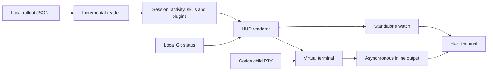

# Codex HUD Architecture

<a href="#english">English</a> · <a href="#korean">한국어</a>

## English

### Overview

Codex HUD reads local rollout JSONL files and renders normalized session metadata.
The default launcher runs Codex in a smaller PTY and composites its terminal
screen above a fixed HUD. A separate watch mode and optional tmux launcher use
the same session/state/rendering components.

| Area | Code |
|---|---|
| Entry, CLI and preferences | [codex-hud.js](../bin/codex-hud.js), [cli.js](../src/cli.js), [config.js](../src/config.js) |
| Refresh and cached state | [watch.js](../src/watch.js), [hud-source.js](../src/hud-source.js) |
| Session selection/read | [sessions.js](../src/sessions.js), [transcript.js](../src/transcript.js) |
| State, activity and skill/plugin detection | [state.js](../src/state.js), [activity.js](../src/activity.js), [skills.js](../src/skills.js) |
| Optional Git metadata | [git.js](../src/git.js) |
| Presentation and cell widths | [render.js](../src/render.js), [terminal.js](../src/terminal.js), [viewport.js](../src/viewport.js) |
| Inline PTY and compositing | [inline.js](../src/inline.js), [screen.js](../src/screen.js), [pty.js](../src/pty.js) |
| Inline terminal output | [output.js](../src/output.js) |
| Native scrollback and resize accounting | [scrollback.js](../src/scrollback.js) |
| Launch arguments and optional tmux | [codex-args.js](../src/codex-args.js), [launch.js](../src/launch.js) |
| Packaging and installation | [package-plugin.py](../scripts/package-plugin.py), [installer guide](../plugins/codex-hud/README.md) |

Inline polling uses `HudSource`; standalone `watch` maintains its own reader.
Both feed the same state and rendering pipeline. Interactive output follows these
paths; `start --tmux` runs Codex and a separate `watch` process in tmux panes.

`status` and `watch` with redirected output, `--once`, or `--json` produce one snapshot.
`demo` renders fixture data, `setup` prints TOML without editing configuration,
and `doctor` reports dependency/session availability. Only inline `start` and
`doctor` load the native PTY module. Preferences resolve from defaults, then the
selected JSON file, then explicit CLI options; see [configuration](../README.md#환경-설정).

### Constraints

Session selection uses the requested project or explicit session. The reader
handles appended/truncated/replaced files without retaining full prompts or tool
outputs in normalized state. Rendering sanitizes terminal controls and clips to
terminal cell widths. The `full` activity order is tools, loaded skills, plugins,
agents, then plan. Skills occupy one clipped, comma-separated line. Only running
agents are displayed; retained completed agents remain available in JSON state.

The inline launcher owns terminal mode restoration and child cleanup. Native
text dragging is enabled by default; host mouse capture, including child requests,
requires `--mouse`. Runtime language switching uses cached state; selection mode
freezes physical painting and releases capture while Codex continues. Resuming
restores the configured mouse policy. Standalone watch follows the same policy. See
[terminal controls](reference/terminal.md) and [session processing](reference/session-data.md).

Inline adds Codex's `--no-alt-screen` once so the emulated normal buffer retains
output. Default mode uses the host normal screen and transfers completed Codex
rows into native scrollback. The wheel and dragging stay with the terminal.
Already transferred output remains available after exit. Frozen selection delays
transfers in a bounded queue; exiting while frozen does not flush pending rows.
`--mouse` keeps the alternate-screen HUD
with internal scrolling. Scrollback markers and resize accounting prevent HUD
redraws and already-archived rows from being appended again.

The [installation workflow](../plugins/codex-hud/README.md) has two steps.
GitHub skill downloads or the repository's `.agents/plugins/marketplace.json`
make the installation skill available; the catalogue points to
`plugins/codex-hud` and is used by `codex plugin marketplace add`.
Registering the plugin does not install the HUD runtime.
`scripts/install-skill.py` inside the skill registers the complete bundle under
the user's or project's `.agents/skills`; it does not install HUD.
The skill's `scripts/install.py` verifies the bundled checksum/version, installs
HUD into the selected prefix, then checks the installed CLI before writing shell
integration.

User scope keeps the existing user data prefix and selected startup files.
Project scope defaults to `<project>/.codex-hud`, requires a prefix inside that
project, and does not edit user startup files or PATH. Its activated Bash/Zsh
function chooses the project executable only for a physical cwd inside that
project, including a Codex `-C`/`--cd` target. An activated user installation is the
fallback outside the project; otherwise the function delegates to Codex.

Packaging includes `docs/` in the npm archive and creates both plugin and
standalone skill ZIPs. See the [installation reference](reference/installation.md)
for ownership, backups, shell state, and partial-failure boundaries.
Follow the [release runbook](runbooks/release.md)
after the final source or documentation edit.

## 한국어

### 개요

Codex HUD는 로컬 rollout JSONL 파일을 읽어 정규화한 세션 정보를 표시합니다.
기본 실행기는 축소된 PTY에서 Codex를 실행하고 가상 터미널 화면 아래에 HUD를
고정합니다. 별도 watch 모드와 선택적 tmux 실행기도 같은 세션·상태·렌더링
구성 요소를 사용합니다.

| 영역 | 코드 |
|---|---|
| 진입점·CLI·설정 | [codex-hud.js](../bin/codex-hud.js), [cli.js](../src/cli.js), [config.js](../src/config.js) |
| 갱신과 상태 캐시 | [watch.js](../src/watch.js), [hud-source.js](../src/hud-source.js) |
| 세션 선택·읽기 | [sessions.js](../src/sessions.js), [transcript.js](../src/transcript.js) |
| 상태·활동·스킬/플러그인 감지 | [state.js](../src/state.js), [activity.js](../src/activity.js), [skills.js](../src/skills.js) |
| 선택적 Git 정보 | [git.js](../src/git.js) |
| 표시와 문자 셀 너비 | [render.js](../src/render.js), [terminal.js](../src/terminal.js), [viewport.js](../src/viewport.js) |
| Inline PTY와 화면 합성 | [inline.js](../src/inline.js), [screen.js](../src/screen.js), [pty.js](../src/pty.js) |
| Inline 터미널 출력 | [output.js](../src/output.js) |
| 실제 터미널 스크롤백·크기 변경 보정 | [scrollback.js](../src/scrollback.js) |
| 실행 인자와 선택적 tmux | [codex-args.js](../src/codex-args.js), [launch.js](../src/launch.js) |
| 패키징과 설치 | [package-plugin.py](../scripts/package-plugin.py), [설치 안내](../plugins/codex-hud/README.md) |

Inline은 `HudSource`로 갱신하고 별도 `watch`는 자체 리더를 유지합니다.
두 방식은 같은 상태·렌더링 처리를 사용합니다. 대화형 출력의 주요 경로는
아래와 같으며, `start --tmux`는 tmux 패널에서 Codex와 별도 `watch` 프로세스를 실행합니다.

`status`와 출력을 리다이렉트하거나 `--once`·`--json`을 지정한 `watch`는 한 번만 출력합니다.
`demo`는 예시 데이터를 표시하고, `setup`은 설정 파일을 수정하지 않고 TOML을
출력하며, `doctor`는 의존성과 세션 가용성을 보고합니다. 네이티브 PTY 모듈은
inline `start`와 `doctor`만 불러옵니다. 설정은 기본값, 선택한 JSON 파일,
명시한 CLI 옵션 순서로 적용합니다. [환경 설정](../README.md#환경-설정)을 참고하세요.

### 유지 조건

요청한 프로젝트나 명시한 세션을 기준으로 기록을 선택합니다. 리더는 파일
추가·축소·교체를 처리하며, 정규화한 상태에 프롬프트나 도구 출력 전체를
보관하지 않습니다. 렌더러는 터미널 제어 문자를 정리하고 실제 셀 너비에 맞춰
출력을 자릅니다. `full` 모드의 활동 순서는 도구, 로드한 스킬, 플러그인,
에이전트, 계획입니다. 스킬은 쉼표로 구분한 한 줄로 표시하고 너비를 넘으면
자릅니다. 에이전트는 실행 중인 경우만 표시하며, 추적 범위 안의 완료된
에이전트는 JSON 상태에 남습니다.

Inline 실행기는 터미널 모드 복원과 자식 프로세스 정리를 담당합니다. 기본
상태에서는 터미널의 드래그 선택을 허용하며, Codex가 요청한 마우스 모드도
`--mouse`를 켠 경우에만 실제 터미널에 적용합니다. 실행 중 언어 전환은 캐시된
상태를 사용하고, 선택 모드는 Codex 실행을 유지한 채 물리 화면 갱신과 마우스
캡처를 멈춥니다. 선택 모드 종료 후에는 설정된 캡처 정책으로 돌아가며,
별도 watch도 같은 정책을 따릅니다.
[터미널 제어](reference/terminal.md)와 [세션 처리](reference/session-data.md)를 참고하세요.

Inline은 Codex의 `--no-alt-screen`을 한 번 추가해 가상 일반 버퍼에 출력을
유지합니다. 기본 모드는 실제 터미널의 일반 화면을 사용하고 완료된 Codex 행을
스크롤백으로 전달합니다. 휠과 드래그는 터미널이 처리하며 이미 전달한 기록은
종료 후에도 남습니다. 선택 모드로 화면을 고정하면 전달할 행을 제한된 대기열에
보관하며, 고정한 채 종료하면 대기 중인 행을 전달하지 않습니다.
`--mouse`는 대체 화면에서 HUD를 고정한 내부 스크롤을 유지합니다.
표식과 크기 변경 보정으로 HUD 갱신이나 이미 기록된 행을 다시 추가하지 않습니다.

[설치 흐름](../plugins/codex-hud/README.md)은 두 단계입니다. GitHub에서 스킬을
다운로드하거나 저장소의 `.agents/plugins/marketplace.json`으로 설치 스킬을
등록합니다. 이 목록은 `plugins/codex-hud`를 가리키며
`codex plugin marketplace add`가 사용합니다. 플러그인 등록만으로 HUD 실행
프로그램을 설치하지 않습니다. 스킬 내부의
`scripts/install-skill.py`는 사용자 또는 프로젝트의 `.agents/skills`에
전체 스킬을 등록하며 HUD를 설치하지 않습니다. 스킬의 `scripts/install.py`는
동봉 패키지의 체크섬·버전을 확인하고 선택한 prefix에 HUD를 설치한 뒤,
설치된 CLI를 검사하고 셸 연결 파일을 씁니다.

사용자 범위는 기존 사용자 데이터 경로와 선택한 셸 시작 파일을 사용합니다.
프로젝트 범위의 기본 경로는 `<프로젝트>/.codex-hud`이며, prefix는 해당 프로젝트
안에 있어야 합니다. 사용자 셸 시작 파일과 PATH는 변경하지 않습니다. 활성화한
Bash/Zsh 함수는 Codex의 `-C`/`--cd` 대상까지 고려한 실제 작업 디렉터리가
프로젝트 안에 있을 때 프로젝트 실행 파일을 사용합니다. 밖에서는 활성화된
사용자 설치가 있으면 그것을 사용하고, 없으면 원래 Codex로 전달합니다.

패키징은 npm 아카이브에 `docs/`를 포함하며 플러그인 ZIP과 단독 스킬
ZIP을 만듭니다. 소유 파일·백업·셸 상태와 부분 실패 경계는
[설치 구현 참조](reference/installation.md)를 참고하세요. 마지막 소스·문서 수정 후에는
[릴리스 런북](runbooks/release.md)을 따라 패키지를 갱신합니다.
